# Finance Data Model — Entity Relationship (ER) Diagram

This document contains the complete Entity-Relationship schema for all Dimension, Fact, and Reference tables in the analytical data model.

---

```mermaid
erDiagram
    %% ========================================================
    %% DIMENSION TABLES
    %% ========================================================
    Dim_Customer {
        string Customer_ID PK "e.g. C00001"
        string Customer_Name
        string Customer_Type "Retail, Distributor, Food Service"
        string Customer_Segment "Enterprise, Mid-Market, SMB"
        string Industry "Restaurants, Retail, Hospitality"
        string Sales_Region
        string Region_ID FK
        string Country
        string State
        string City
        string Parent_Customer
        string Account_Manager
    }

    Dim_Product {
        string Product_ID PK "e.g. P0001"
        string Product_Code
        string Product_Name
        string Product_Category "Paper Plates, Cups, Bowls, Containers, Cutlery"
        string Product_Subcategory "Standard, Premium, Heavy Duty"
        string Brand "EcoServe, PurePack, EarthWare"
        string SKU
        string Product_Line
        string Plant_ID FK
        double Unit_Weight_G
        double Cube_Index
        string Material_Type
        string Launch_Date
        string Discontinued_Flag
    }

    Dim_Date {
        int Date_Key PK "e.g. 20250101"
        string Date "YYYY-MM-DD"
        int Day
        int Week
        string Month
        string Quarter
        int Year
        int Fiscal_Period
        string Fiscal_Quarter
        int Fiscal_Year
    }

    Dim_Sales_Rep {
        string Sales_Rep_ID PK "e.g. SR001"
        string Sales_Rep_Name
        string Sales_Team
        string Sales_Manager
        string Region_ID FK
        string Region
        string Business_Unit FK
    }

    Dim_Rebate_Program {
        string Customer_ID PK "FK to Dim_Customer"
        string Rebate_Program_ID "e.g. RP001"
        string Rebate_Program_Name
        string Rebate_Type "Volume, Growth, Promotional"
        double Rebate_Rate
        double Threshold_Amount
    }

    Dim_Profit_Center {
        string Profit_Center_ID PK "e.g. PC001"
        string Profit_Center_Name
        string Business_Unit
        string Division
        string Manager
    }

    Dim_Organization {
        string Organization_ID PK "e.g. ORG001"
        string Business_Unit
        string Division
        string Department
        string Cost_Center
        string Profit_Center FK "PC001"
        string Sales_Org
        string Region_ID FK
        string Region
        string Country
    }

    Ref_Material_Cost {
        string Plant_ID PK
        string Month PK
        string Material_Type PK
        double Cost_Per_KG
    }

    %% ========================================================
    %% FACT TABLES
    %% ========================================================
    Fact_Sales {
        string Transaction_ID PK "e.g. T0000001"
        string Order_ID
        string Invoice_ID
        string Invoice_Line_ID
        string Transaction_Date FK
        string Customer_ID FK
        string Product_ID FK
        string Sales_Rep_ID FK
        double Quantity_Sold
        double List_Unit_Price
        double Gross_Sales_Amount
        double Discount_Amount
        double Returns_Amount
        double Net_Sales_Amount
    }

    Fact_COGS {
        string Transaction_ID PK "FK to Fact_Sales"
        string Production_Date
        string Plant_ID
        string Product_ID FK
        double Units_Produced
        double Machine_Hours
        double Labor_Hours
        double Material_Cost
        double Labor_Cost
        double Total_Direct_COGS
    }

    Fact_Freight {
        string Order_ID PK "FK to Fact_Sales.Order_ID"
        string Ship_Date
        string Origin_Plant
        string Destination_Region
        double Total_Weight_KG
        double Total_Cube
        double Freight_Cost
    }

    Fact_Overhead_Pool {
        string Plant_ID PK
        string Month PK
        double Overhead_Pool_USD
    }

    Fact_Commission {
        string Sales_Rep_ID PK
        string Month PK
        double Commissionable_Sales
        double Commission_Rate
        double Commission_Amount
    }

    Fact_Rebate {
        string Customer_ID PK
        string Month PK
        double Eligible_Sales
        double Rebate_Rate
        double Rebate_Amount
    }

    Fact_Operating_Expense {
        string Expense_ID PK
        int GL_Account
        string Cost_Center
        string Expense_Function
        string Expense_Date
        double Expense_Amount
    }

    Fact_Budget {
        int Fiscal_Year PK
        int Fiscal_Period PK
        string Profit_Center PK
        string Cost_Center
        double Budget_Revenue
        double Budget_Cost
        double Budget_Profit
        double Forecast_Revenue
        double Forecast_Cost
    }

    %% ========================================================
    %% RELATIONSHIPS
    %% ========================================================
    Dim_Customer ||--o{ Fact_Sales : "places"
    Dim_Product ||--o{ Fact_Sales : "sold_in"
    Dim_Date ||--o{ Fact_Sales : "occurs_on"
    Dim_Sales_Rep ||--o{ Fact_Sales : "credited_for"
    Dim_Customer ||--o{ Dim_Rebate_Program : "governed_by"

    Fact_Sales ||--|| Fact_COGS : "produces"
    Fact_Sales }o--|| Fact_Freight : "shipped_under"
    Dim_Customer ||--o{ Fact_Rebate : "receives"
    Dim_Sales_Rep ||--o{ Fact_Commission : "earns"
    Dim_Profit_Center ||--o{ Fact_Budget : "targeted_in"
```

