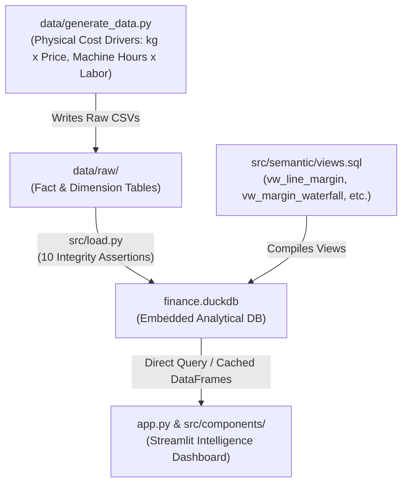

# Meridian Corp — Demand & Profitability Intelligence Platform

[](https://manufacturer-demand-profit.streamlit.app/)

Enterprise demand analytics, margin waterfall deconstruction, and human-in-the-loop profitability intelligence for a recycled foodservice products manufacturer.

---

## 🌐 Live Application
* **Production URL:** [https://manufacturer-demand-profit.streamlit.app/](https://manufacturer-demand-profit.streamlit.app/)
* **Engine:** DuckDB embedded analytics with ANSI SQL Semantic Layer (`finance.duckdb`)

---

## 🏗️ Architecture & Data Pipeline



---

## 📊 Core Features & Dashboard Tabs

1. **📊 Executive Overview (`src/components/overview.py`):**
   * High-level financial KPIs: Gross Revenue, Net Revenue, Units Sold, Gross Profit, and Pocket Contribution Margin.
   * Monthly revenue/profit trends and regional revenue share breakdowns.
   * Top 5 Products and Top 5 Customer Accounts with margin performance.
2. **📦 Demand Analytics (`src/components/demand.py`):**
   * Granular historical order volume (`Quantity_Sold`) over time by product category.
   * Seasonality analysis matrix by month and customer channel volume grouping.
   * Price elasticity and discount sensitivity regression analysis.
3. **💰 Profit Waterfall & Margins (`src/components/profit.py`):**
   * Complete financial waterfall: $\text{Gross Sales} \rightarrow \text{Discounts} \rightarrow \text{Returns} \rightarrow \text{Net Sales} \rightarrow \text{Material} \rightarrow \text{Labor} \rightarrow \text{Gross Profit} \rightarrow \text{Freight} \rightarrow \text{Rebates} \rightarrow \text{Contribution Margin}$.
   * **⚖️ Human-in-the-Loop Overhead Allocation Sensitivity:** Side-by-side comparison of **Units Produced Basis** vs. **Machine Hours Basis** (revealing how category margins shift, such as Cutlery switching between profitable and loss-making).
   * Customer Profitability Matrix exposing margin erosion ("Rebate Trap").
4. **🏢 OpEx & Budget Targets (`src/components/budget_opex.py`):**
   * Operating expenses grouped by function (SG&A, Operations, Sales, Marketing) and cost centers.
   * Target budget vs. management forecast benchmarks across profit centers.

---

## 🚀 Quick Start

### 1. Installation
```bash
# Clone the repository
git clone https://github.com/svijetaj/manufacturer-demand-profitability.git
cd manufacturer-demand-profitability

# Create virtual environment and install dependencies
python3 -m venv .venv
source .venv/bin/activate
pip install -r requirements.txt
```

### 2. Generate Synthetic Data & Build DuckDB
```bash
# Generate driver-based synthetic dataset
python3 data/generate_data.py --out data/raw

# Load CSVs, compile semantic views, and run 10 integrity assertions
python3 src/load.py --raw data/raw --db finance.duckdb --views src/semantic/views.sql
```

### 3. Launch Dashboard
```bash
streamlit run app.py
```

---

## 🧪 Data Quality & Integrity Assertions

The database loader (`src/load.py`) automatically runs 10 strict assertions prior to loading:
1. `[ok]` Net Sales ties to components ($\text{Gross} - \text{Discounts} - \text{Returns} = \text{Net}$).
2. `[ok]` No future-dated transactions.
3. `[ok]` No future-dated production.
4. `[ok]` Every order belongs to exactly one customer.
5. `[ok]` Every sales line maps to a valid product in `Dim_Product`.
6. `[ok]` Every sales line maps to a valid customer in `Dim_Customer`.
7. `[ok]` Every positive sales line has a corresponding manufacturing cost row in `Fact_COGS`.
8. `[ok]` Overhead is unallocated in `Fact_Overhead_Pool` (not pre-baked into fact rows).
9. `[ok]` OpEx is a plausible proportion of total revenue ($< 40\%$).
10. `[ok]` Budget targets align within $2\times$ of actual revenue scale.

---

## 📚 Documentation
* [Data Dictionary](docs/DATA_DICTIONARY.md)
* [Data Model Descriptive Report](docs/DATA_MODEL_DESCRIPTIVE_REPORT.md)
* [Predictive Modeling & ML Specification](docs/PREDICTIVE_MODELING_SPECIFICATION.md)
* [Project Scope](docs/SCOPE.md)
* [Architectural Decisions](docs/DECISIONS.md)
* [Workstreams & Task Force Breakdown](docs/WORKSTREAMS.md)
* [Project Implementation Roadmap](docs/PROJECT_IMPLEMENTATION_ROADMAP.md)
* [Phase 1 Implementation Notes](docs/PHASE_1_IMPLEMENTATION.md)
* [Phase 2 Implementation Notes](docs/PHASE_2_IMPLEMENTATION.md)

