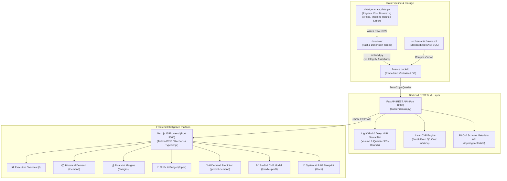

# Meridian Corp — Demand & Profitability Intelligence Platform (v2.0)

Enterprise demand analytics, margin waterfall deconstruction, dual-engine ML forecasting, and human-in-the-loop profitability intelligence for a recycled foodservice products manufacturer.

Built with **Next.js 15 (React 19 / TypeScript)**, **FastAPI REST API**, and **DuckDB Columnar OLAP**.

---

## 🏗️ System Architecture & Data Pipeline



---

## 📊 Core Features & Interactive Pages

1. **📊 Executive Overview (`/`):**
   * High-level financial KPIs: Gross Revenue, Net Revenue, Units Sold, Gross Profit, and Pocket Contribution Margin.
   * Monthly revenue/profit trajectories and regional revenue share breakdowns.
   * Top 5 Products and Top 5 Customer Accounts with margin performance.
2. **📦 Demand Analytics (`/demand`):**
   * Granular historical order volume (`Quantity_Sold`) with Monthly, Weekly, and Daily aggregation switches.
   * Seasonality analysis matrix by month and customer channel volume grouping.
   * Econometric price elasticity and discount sensitivity OLS regression.
3. **💰 Profit Waterfall & Margins (`/margins`):**
   * Complete financial waterfall: $\text{Gross Sales} \rightarrow \text{Discounts} \rightarrow \text{Returns} \rightarrow \text{Net Sales} \rightarrow \text{Material} \rightarrow \text{Labor} \rightarrow \text{Gross Profit} \rightarrow \text{Freight} \rightarrow \text{Rebates} \rightarrow \text{Contribution Margin}$.
   * **⚖️ Human-in-the-Loop Overhead Allocation Sensitivity:** Side-by-side comparison of **Units Produced Basis** vs. **Machine Hours Basis** (revealing SKU margin shifts on high-tooling products).
   * Customer Profitability Matrix exposing margin erosion ("Rebate Trap").
4. **🏢 OpEx & Budget Targets (`/opex`):**
   * Operating expenses grouped by function (SG&A, Operations, Sales, Marketing) and cost centers.
   * Target budget vs. management forecast benchmarks across corporate profit centers.
5. **🔮 AI Demand Prediction (ML) (`/predict-demand`):**
   * **Deep Neural Network Engine:** Forecasting with **Deep Multi-Layer Perceptrons (MLP 128-64-32)**.
   * Forward volume and revenue timelines with 90% confidence bands (P10, P50, P90).
   * **Interactive Simulation Sliders:** Live catalog price changes, promo discount shifts, and macroeconomic market shocks.
   * Plain-English ranked demand drivers.
6. **📈 Profitability Prediction (Linear) (`/predict-profit`):**
   * **Cost-Volume-Profit (CVP) Break-Even Model:** Visualizing $R(Q) = P \cdot Q$, $TC(Q) = v \cdot Q + F$, and $\Pi(Q) = (P-v)Q - F$ with Break-Even Volume $Q^*$ and Margin of Safety buffer.
   * **Cost Inflation Levers:** Raw material commodity price shifts, labor wage adjustments, and overhead allocation switchers.
7. **📖 System & RAG Documentation (`/docs`):**
   * RAG-ready REST endpoints (`/api/rag/metadata` & `/api/rag/schema`) exposing accounting formulas, product cost drivers, and DuckDB schemas for LLM agent grounding.

---

## 🚀 Quick Start

### 1. Installation

```bash
# Clone the repository
git clone https://github.com/svijetaj/manufacturer-demand-profitability.git
cd manufacturer-demand-profitability

# Setup Python & Node dependencies
make setup
```

### 2. Build DuckDB & Semantic Views

```bash
# Generate synthetic dataset and compile views in finance.duckdb
make data
```

### 3. Launch the Platform (Next.js + FastAPI)

```bash
# Starts FastAPI (port 8000) and Next.js (port 3000)
make dev

# Or directly run:
./run_platform.sh
```

* **Frontend UI:** [http://localhost:3000](http://localhost:3000)
* **Backend API Docs (Swagger):** [http://localhost:8000/docs](http://localhost:8000/docs)
* **RAG Metadata Endpoint:** [http://localhost:8000/api/rag/metadata](http://localhost:8000/api/rag/metadata)

---

## 🧪 Testing & Verification

```bash
# Run automated backend test suite
make test

# Build production Next.js bundle
make build-frontend
```

---

## 🧪 Data Quality & Integrity Assertions

The database loader (`src/load.py`) automatically runs 10 strict assertions prior to loading:
1. `[ok]` Net Sales ties to components ($\text{Gross} - \text{Discounts} - \text{Returns} = \text{Net}$).
2. `[ok]` No future-dated transactions.
3. `[ok]` No future-dated production.
4. `[ok]` Every order belongs to exactly one customer.
5. `[ok]` Every sales line maps to a valid product in `Dim_Product`.
6. `[ok]` Every sales line maps to a valid customer in `Dim_Customer`.
7. `[ok]` Every positive sales line has a corresponding manufacturing cost row in `Fact_COGS`.
8. `[ok]` Overhead is unallocated in `Fact_Overhead_Pool` (not pre-baked into fact rows).
9. `[ok]` OpEx is a plausible proportion of total revenue ($< 40\%$).
10. `[ok]` Budget targets align within $2\times$ of actual revenue scale.

---

## 📚 Documentation
* [🚀 Free Deployment Guide (Vercel + Render / Hugging Face)](docs/DEPLOYMENT.md)
* [Architecture & Methodology Reference Guide](docs/ARCHITECTURE_AND_METHODOLOGY_GUIDE.md)
* [Neural Networks vs. GBDTs & Linear Profitability Modeling](docs/NEURAL_NET_AND_LINEAR_PROFITABILITY.md)
* [Data Dictionary](docs/DATA_DICTIONARY.md)
* [Data Model Descriptive Report](docs/DATA_MODEL_DESCRIPTIVE_REPORT.md)
* [Predictive Demand Modeling & ML Specification](docs/PREDICTIVE_MODELING_SPECIFICATION.md)
* [Predictive Profitability & 2-Stage Financial Specification](docs/PROFITABILITY_PREDICTION_SPECIFICATION.md)
