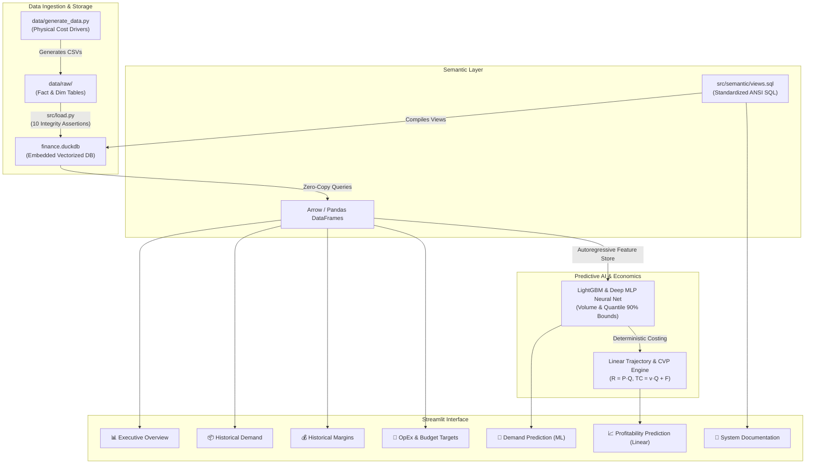
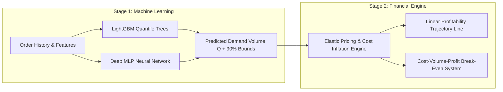

# 📖 Complete Architecture & Methodology Reference Guide

This comprehensive reference document serves as the single source of truth for understanding the **Enterprise Demand & Profitability Intelligence Platform**. It explains the entire technical stack, physical manufacturing data generation, DuckDB analytical engine, ANSI SQL semantic calculations, dual machine learning demand forecasting engines, and linear profitability models.

---

## 1. System Architecture & High-Level Pipeline

---

## 2. Raw Data Architecture & Cost Driver Physics

All data models represent a realistic foodservice packaging manufacturer producing recycled paper and bio-resin products (**Bagasse Containers, Molded Pulp Plates, PLA Cutlery, Paper Straws, Hot Cups**).

### Manufacturing Cost Physics
1. **Raw Material Cost:**
   $$\text{Material Cost} = \text{Units Produced} \times \left(\frac{\text{Unit Weight (g)}}{1000}\right) \times \text{Commodity Price (\$ / kg)} \times (1 + \text{Scrap Rate})$$
2. **Direct Labor Cost:**
   $$\text{Labor Cost} = \text{Machine Runtime Hours} \times \text{Plant Labor Wage Rate (\$/hr)}$$
3. **Outbound Freight Allocation:**
   $$\text{Cube Index} = \frac{\text{L} \times \text{W} \times \text{H}}{1000}, \quad \text{Line Freight} = \text{Order Freight} \times \left(\frac{\text{Line Volume Cube}}{\sum \text{Order Volume Cube}}\right)$$
4. **Customer Rebates:**
   $$\text{Rebate Amount} = \text{Net Sales Amount} \times \text{Agreed Contract Rebate Rate (\% nominal)}$$

### Relational Schema

| Table Name | Type | Key Fields | Business Purpose |
| :--- | :--- | :--- | :--- |
| `Fact_Sales` | Fact | `Transaction_ID`, `Order_ID`, `Product_ID`, `Customer_ID`, `Quantity_Sold`, `Gross_Sales_Amount`, `Discount_Amount`, `Net_Sales_Amount` | Customer order transactions and discount allowances. |
| `Fact_COGS` | Fact | `Transaction_ID`, `Product_ID`, `Plant_ID`, `Units_Produced`, `Machine_Hours`, `Material_Cost`, `Labor_Cost` | Direct manufacturing costs tied 1-to-1 with sales orders. |
| `Fact_Freight` | Fact | `Order_ID`, `Carrier_ID`, `Freight_Cost`, `Distance_Miles` | Pallet freight shipping costs per order. |
| `Fact_Overhead_Pool` | Fact | `Plant_ID`, `Month`, `Overhead_Pool_USD` | Unallocated fixed plant indirect expenses. |
| `Fact_OpEx` | Fact | `Expense_ID`, `Cost_Center_ID`, `Function`, `Actual_Amount`, `Date` | SG&A, Operations, Sales, and Marketing operating expenses. |
| `Fact_Budget_Target` | Fact | `Profit_Center_ID`, `Quarter`, `Budget_Net_Sales`, `Budget_Operating_Profit` | Management targets for variance analysis. |
| `Dim_Product` | Dimension | `Product_ID`, `Product_Name`, `Product_Category`, `Unit_Weight_G`, `Cube_Index`, `List_Price` | Product technical specifications and dimensions. |
| `Dim_Customer` | Dimension | `Customer_ID`, `Customer_Name`, `Customer_Segment`, `Customer_Type`, `Sales_Region` | Commercial customer channels (Broadline, Direct, QSR Chains). |
| `Dim_Rebate_Program` | Dimension | `Customer_ID`, `Rebate_Rate` | Tiered volume rebate contract terms. |

---

## 3. DuckDB Analytical Engine & Semantic Views

### Why DuckDB?
DuckDB is an in-process, columnar OLAP database that enables vectorized SQL queries directly over memory and Parquet/DuckDB tables. Joins across 10,000+ transaction lines, COGS records, and freight cube allocations execute in $<15\text{ms}$.

### Underlying SQL Views (`src/semantic/views.sql`)

1. **`vw_sales_clean`:** Filters out returns and planted duplicate transaction IDs to isolate pure sales revenue.
2. **`vw_line_margin`:** Deconstructs each transaction line into Net Sales, Material Cost, Labor Cost, Cube-Allocated Freight, Rebate Allowance, Gross Profit, and Contribution Margin.
3. **`vw_customer_profitability`:** Exposes customer-level pocket margin after freight and rebates (revealing the "Rebate Trap").
4. **`vw_overhead_allocated`:** Computes side-by-side overhead allocation across **Units Produced Basis** vs. **Machine Runtime Hours Basis**.
5. **`vw_sku_net_margin_by_basis`:** Reconciles SKU-level net margins under both overhead allocation methodologies.
6. **`vw_margin_waterfall`:** Aggregates monthly waterfall totals guaranteeing $\$0.00$ discrepancy.

---

## 4. Machine Learning Demand Forecasting Engine

The platform implements a **2-Stage Cascaded Predictive Pipeline**:

### LightGBM vs. Deep Neural Network (MLP)

| Dimension | LightGBM (Gradient Boosted Trees) | Deep Neural Network (MLP 128-64-32) |
| :--- | :--- | :--- |
| **Validation $R^2$** | **0.6275** | **0.4953** |
| **WAPE % (Error)** | **38.91%** | **46.86%** |
| **MAE (Units)** | **13,309 units** | **16,028 units** |
| **Training Speed** | **~0.15 seconds** | **~0.77 seconds** |
| **Uncertainty Bounds** | Native Quantile Regressors ($\alpha=0.05, 0.95$) | Empirical Validation Residual Percentiles ($p_{05}, p_{95}$) |
| **Feature Scaling** | Raw unscaled features | Strict `StandardScaler` + `OneHotEncoder` |

---

## 5. Linear Profitability & CVP Break-Even Mechanics

### 1. Forward Profit Trajectory Line
Fits an Ordinary Least Squares (OLS) linear slope over projected monthly profits:
$$\text{Net Profit}_t = \beta_0 + \beta_1 \cdot t$$
Provides a clear executive summary (e.g. *📈 Profit Growth Trend: +$14.2k / month*).

### 2. Cost-Volume-Profit (CVP) Break-Even Linear Model
Parameterizes corporate profit as a linear function of volume $Q$:

* **Revenue Line:** $R(Q) = P \times Q$
* **Total Cost Line:** $TC(Q) = v \times Q + F$
* **Net Profit Line:** $\Pi(Q) = (P - v) \times Q - F$
* **Break-Even Volume Target ($Q^*$):**
  $$Q^* = \frac{F}{P - v} = \frac{\text{Total Fixed Overhead}}{\text{Unit Contribution Margin}}$$
* **Margin of Safety (MoS):**
  $$\text{MoS}_{\%} = \left(\frac{Q_{\text{forecast}} - Q^*}{Q_{\text{forecast}}}\right) \times 100\%$$
