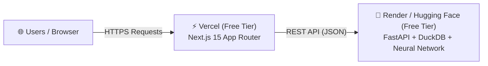

# 🚀 Free Deployment Guide: Meridian Corp Intelligence Platform

This guide details how to deploy the entire **Meridian Corp Intelligence Platform** for **100% FREE ($0/month)** using **Vercel** for the Next.js frontend and **Render** or **Hugging Face Spaces** for the FastAPI Python backend.

---

## 📐 Deployment Overview



| Component | Host Service | Pricing Tier | Specs |
|---|---|---|---|
| **Frontend** (`Next.js 15`) | **Vercel** | Free Hobby Tier | Unlimited CDN Edge Bandwidth, Auto SSL, GitHub CI/CD |
| **Backend** (`FastAPI` + `DuckDB` + `Neural Net`) | **Render** or **Hugging Face Spaces** | Free Tier | 512 MB – 16 GB RAM, Containerized Python |

---

## Step 1: Deploy Backend to Render (Free Web Service)

Render provides free containerized web hosting directly from GitHub.

1. **Push your code to GitHub**:
   ```bash
   git add .
   git commit -m "Add production Dockerfile and clean codebase"
   git push origin main
   ```

2. **Create New Web Service on Render**:
   - Go to [render.com](https://render.com) and log in.
   - Click **New +** $\rightarrow$ **Web Service**.
   - Connect your GitHub repository (`manufacturer-demand-profitability`).
   - Select **Docker** as the runtime environment.
   - Choose the **Free** instance type ($0/month).

3. **Deploy Service**:
   - Click **Create Web Service**. Render will automatically build the `Dockerfile` and start your FastAPI service.
   - Copy your live backend URL (e.g. `https://meridian-finance-api.onrender.com`).
   - Verify health check by visiting: `https://meridian-finance-api.onrender.com/api/health`

---

## Step 2: Deploy Frontend to Vercel (Free Next.js Hosting)

Vercel provides native zero-configuration hosting for Next.js apps.

1. **Import Project into Vercel**:
   - Go to [vercel.com](https://vercel.com) and log in with GitHub.
   - Click **Add New...** $\rightarrow$ **Project**.
   - Import your GitHub repository (`manufacturer-demand-profitability`).

2. **Configure Project Settings**:
   - **Root Directory**: Select `frontend` (Click **Edit** next to Root Directory and choose `frontend`).
   - **Framework Preset**: `Next.js` (automatically detected).

3. **Add Environment Variable**:
   - Expand the **Environment Variables** section.
   - Add:
     - **Key**: `NEXT_PUBLIC_API_URL`
     - **Value**: `https://meridian-finance-api.onrender.com` (replace with your actual Render backend URL)

4. **Deploy**:
   - Click **Deploy**. Vercel will build the frontend and generate a live production URL (e.g. `https://meridian-finance-intelligence.vercel.app`).

---

## Step 3: Alternative Backend Option — Hugging Face Spaces (Completely Free, No Sleep Mode)

If you want a backend that **never sleeps** (Render free tier sleeps after 15 mins of inactivity), you can deploy the Docker container to **Hugging Face Spaces** for free with 16GB RAM:

1. Go to [huggingface.co/spaces](https://huggingface.co/spaces) and click **Create new Space**.
2. Select SDK: **Docker** $\rightarrow$ **Blank**.
3. Clone the space repository locally or push your files:
   ```bash
   git remote add hf https://huggingface.co/spaces/YOUR_USERNAME/meridian-finance-api
   git push hf main
   ```
4. Update `NEXT_PUBLIC_API_URL` on Vercel to point to your Hugging Face Space URL (`https://YOUR_USERNAME-meridian-finance-api.hf.space`).

---

## 🛠️ Post-Deployment Verification Checklist

- [ ] Backend `/api/health` returns `{"status": "healthy", "database": "finance.duckdb"}`
- [ ] Frontend loads KPIs on Executive Overview (`/`)
- [ ] AI Demand Prediction (`/predict-demand`) runs simulation with Neural Network
- [ ] Financial Margins (`/margins`) renders waterfall and customer profitability matrix

---

*Congratulations! Your Enterprise Demand & Profitability Intelligence Platform is now live in production at $0/month cost.*
