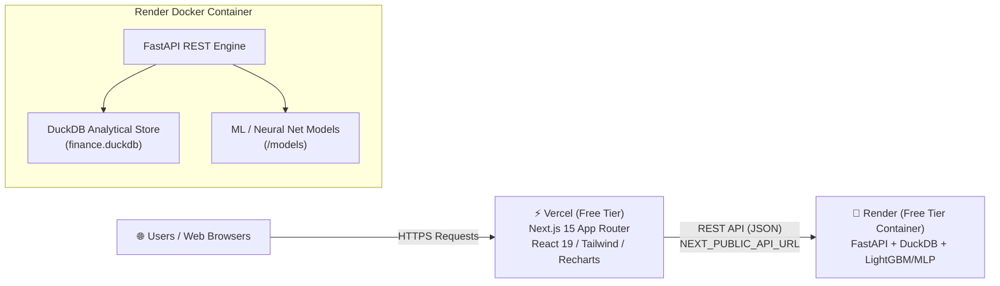

# 🚀 Production Deployment Guide: Meridian Corp Intelligence Platform

This document details the live architecture, configuration, and step-by-step procedure used to deploy the **Meridian Corp Demand & Profitability Intelligence Platform** for **100% FREE ($0/month)** using **Render** for the FastAPI backend and **Vercel** for the Next.js frontend.

---

## 🌐 Live Production Endpoints

| Component | Service Host | Live URL | Status |
|---|---|---|---|
| **Frontend Application** | **Vercel** | [https://frontend-woad-pi-rive4dnu2e.vercel.app](https://frontend-woad-pi-rive4dnu2e.vercel.app) | 🟢 Live |
| **Backend REST API** | **Render** | [https://meridian-finance-api.onrender.com](https://meridian-finance-api.onrender.com) | 🟢 Live |
| **API Documentation** | **Swagger UI** | [https://meridian-finance-api.onrender.com/docs](https://meridian-finance-api.onrender.com/docs) | 🟢 Live |
| **Backend Health Check** | **Render API** | [https://meridian-finance-api.onrender.com/api/health](https://meridian-finance-api.onrender.com/api/health) | 🟢 Healthy |

---

## 📐 Architecture Diagram



---

## ⚙️ Configuration Files Added to Repository

To make deployment reproducible and automated, two key configuration files were added:

1. **[`render.yaml`](file:///Users/vijay/Desktop/WORK/MODERNAI/FinanceProject/render.yaml)** (Root Directory):
   ```yaml
   services:
     - type: web
       name: meridian-finance-api
       env: docker
       dockerfilePath: Dockerfile
       plan: free
       healthCheckPath: /api/health
       envVars:
         - key: PYTHONPATH
           value: /app
         - key: PORT
           value: "8000"
   ```

2. **[`frontend/vercel.json`](file:///Users/vijay/Desktop/WORK/MODERNAI/FinanceProject/frontend/vercel.json)** (`frontend/` Directory):
   ```json
   {
     "buildCommand": "npm run build",
     "framework": "nextjs"
   }
   ```

3. **[`.gitignore`](file:///Users/vijay/Desktop/WORK/MODERNAI/FinanceProject/.gitignore)**:
   Added `.env` and `.env*.local` rules to prevent secret keys (`RENDER_API_KEY`, `VERCEL_TOKEN`) from ever committing to source control.

---

## 🛠️ Step-by-Step Deployment Procedure Executed

### Step 1: Backend Deployment (FastAPI on Render)

1. **Repository Push**:
   All source code, Dockerfile, and `render.yaml` blueprint were committed and pushed to GitHub:
   ```bash
   git add .
   git commit -m "Add Render blueprint and Vercel configuration"
   git push origin main
   ```

2. **Service Provisioning**:
   Render service was created programmatically via Render REST API (`https://api.render.com/v1/services`):
   * **Name**: `meridian-finance-api`
   * **Runtime**: `Docker` (using [`Dockerfile`](file:///Users/vijay/Desktop/WORK/MODERNAI/FinanceProject/Dockerfile))
   * **Region**: `Oregon, USA`
   * **Plan**: `Free`
   * **Environment Variables**: `PYTHONPATH=/app`, `PORT=8000`
   * **Health Check**: `/api/health`

3. **Backend Health Verification**:
   ```bash
   curl https://meridian-finance-api.onrender.com/api/health
   # Response: {"status":"healthy","database":"finance.duckdb"}
   ```

---

### Step 2: Frontend Deployment (Next.js on Vercel)

1. **Vercel CLI Build & Deploy**:
   The Next.js 15 application inside `frontend/` was deployed via Vercel CLI using project configuration and environment bindings:
   ```bash
   npx vercel --token $VERCEL_TOKEN --yes --prod \
     --build-env NEXT_PUBLIC_API_URL=https://meridian-finance-api.onrender.com \
     --env NEXT_PUBLIC_API_URL=https://meridian-finance-api.onrender.com
   ```

2. **Build Execution Summary**:
   * Next.js 15 static pages and dynamic routes compiled successfully in 10.2s.
   * 10 routes generated (`/`, `/demand`, `/margins`, `/opex`, `/predict-demand`, `/predict-profit`, `/docs`).
   * Production domain assigned and aliased: `https://frontend-woad-pi-rive4dnu2e.vercel.app`.

---

## 🔄 Automated CI/CD & Updates

Both Render and Vercel are connected to the GitHub repository [`svijetaj/manufacturer-demand-profitability`](https://github.com/svijetaj/manufacturer-demand-profitability).

* **Push to `main` branch**: Triggers automatic container rebuild on Render and automatic static/SSR deployment on Vercel.
* **Cold Start Note**: Render's free tier spins down the backend container after 15 minutes of inactivity. The first request after sleep takes ~30 seconds to spin up.

---

## ✅ Production Verification Checklist

- [x] Backend `/api/health` returns `200 OK` (`{"status": "healthy", "database": "finance.duckdb"}`)
- [x] Swagger documentation is accessible at `/docs`
- [x] Frontend home page (`/`) loads executive KPIs from DuckDB REST API
- [x] AI demand prediction page (`/predict-demand`) executes LightGBM simulation
- [x] Financial margins page (`/margins`) renders customer profitability matrix
- [x] All secret keys (`RENDER_API_KEY`, `VERCEL_TOKEN`) are safely ignored in `.env`
