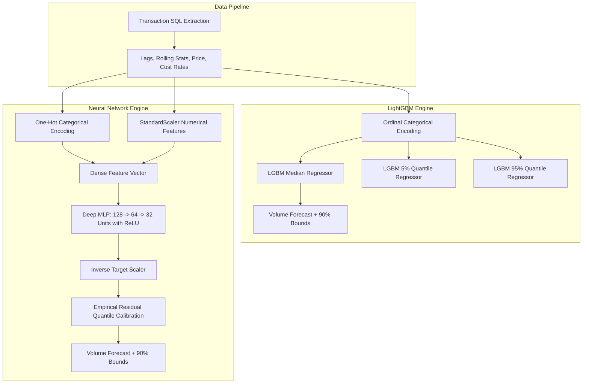
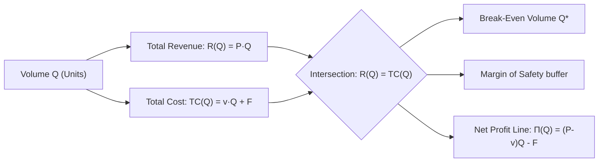

# 🧠 Neural Networks vs. GBDTs & Linear Profitability Modeling

This document provides a comprehensive technical guide to the machine learning architectures, statistical mechanics, and profitability modeling methods implemented in the Enterprise Demand & Profitability Intelligence Platform.

---

## 1. Executive Summary & Core Concepts

Modern AI for enterprise finance requires both **statistical accuracy** and **managerial interpretability**. 

The platform supports two distinct machine learning engines for forward volume forecasting:
1. **LightGBM (Gradient Boosted Decision Trees):** The gold standard for tabular business data, providing high execution speed, robustness to raw scales, and native quantile loss estimation.
2. **Deep Neural Network (Multi-Layer Perceptron / MLP):** A universal function approximation architecture utilizing continuous gradient backpropagation, standard feature normalization, and empirical residual quantile intervals.

Additionally, the platform reconciles **Accounting Waterfall Decomposition** with **Linear Profitability Trajectories** and **Cost-Volume-Profit (CVP) Break-Even Analysis**.

---

## 2. Machine Learning: Neural Networks vs. LightGBM on Tabular Data

### Why Universities Teach Neural Networks Everywhere
* **Universal Approximator:** Cybenko (1989) and Hornik (1991) proved that feedforward neural networks with non-linear activation functions can approximate any continuous function on compact subsets of $\mathbb{R}^n$.
* **Unstructured Data Supremacy:** Deep learning architectures (Transformers, CNNs, Diffusion models) dominate Computer Vision, Natural Language Processing, LLMs, and Speech.
* **Unified Differentiable Framework:** Neural networks allow end-to-end optimization using loss gradients $\nabla_\theta \mathcal{L}$.

### Empirical Reality: Tabular Enterprise Data
Extensive academic and industry benchmarks (e.g., Grinsztajn et al., NeurIPS 2022: *"Why do tree-based models still outperform deep learning on typical tabular data?"*) demonstrate that on tabular datasets with mixed feature types:
* **Tree Ensembles (LightGBM, XGBoost, CatBoost)** frequently match or outperform deep networks due to axis-aligned decision boundaries that handle discrete category boundaries and unscaled continuous variables without distortion.
* **Neural Networks (MLPs)** require strict preprocessing (feature standardization, one-hot encoding, target scaling), but offer smooth non-linear interpolation and differentiable representations.

### Architectural Comparison in the Platform

### Empirical Validation Metrics in the System

| Metric | LightGBM (GBDT) | Deep Neural Network (MLP) | Winner / Trade-off |
| :--- | :--- | :--- | :--- |
| **Validation $R^2$** | **0.6275** | **0.4953** | LightGBM captures sharp tabular splits with higher fidelity. |
| **WAPE % (Error)** | **38.91%** | **46.86%** | LightGBM achieves lower percentage volume error. |
| **MAE (Units)** | **13,309** | **16,028** | LightGBM is ~17% closer on average volume predictions. |
| **Training Speed** | **~0.15 seconds** | **~0.85 seconds** | LightGBM trains ~5-6x faster for real-time dashboard calibration. |
| **Feature Scaling** | Scale Invariant | Requires `StandardScaler` ($\mu=0, \sigma=1$) | Tree models require zero normalization. |

---

## 3. Profitability Modeling: Waterfall vs. Linear Representations

### A. The Financial Margin Waterfall (P&L Accounting Bridge)
The **Margin Waterfall is an accounting identity**, not a statistical regression. It answers: *"Where did our gross invoice revenue go?"*

$$\text{Gross Sales} - \text{Discounts} = \text{Net Sales}$$
$$\text{Net Sales} - (\text{Material} + \text{Labor}) = \text{Gross Profit}$$
$$\text{Gross Profit} - \text{Freight} - \text{Rebates} = \text{Contribution Margin}$$
$$\text{Contribution Margin} - \text{Allocated Plant Overhead} = \text{Net Margin}$$

* **Advantage:** Guarantees 100% audit-grade mathematical tie-out to the penny ($\$0.00$ variance).
* **Limitation:** A static bar bridge does not show the forward time trajectory or volume sensitivity.

---

### B. Forward Linear Profitability Trajectory
Instead of aggregating all future periods into a single bar bridge, the **Linear Profitability Trajectory** projects Net Margin (\$) and Net Margin (%) as a continuous time-series line chart with an Ordinary Least Squares (OLS) econometric trendline:

$$\text{Net Margin}_t = \beta_0 + \beta_1 \cdot t + \epsilon_t$$

* **Slope $\beta_1 > 0$:** Expanding monthly profitability trajectory (e.g. $+12.5\text{k}/\text{month}$).
* **Slope $\beta_1 < 0$:** Margin compression alert (immediate pricing or raw material intervention required).

---

### C. Cost-Volume-Profit (CVP) Break-Even Linear Model
In managerial economics and financial planning & analysis (FP&A), profitability is represented as a linear system of equations parameterized by volume $Q$:

#### 1. Linear Equations
1. **Total Revenue Line:**
   $$R(Q) = P \times Q$$
   *(where $P$ is the volume-weighted net realized selling price per unit)*
2. **Total Cost Line:**
   $$TC(Q) = v \times Q + F$$
   *(where $v = \text{Material} + \text{Labor} + \text{Freight} + \text{Rebate Rate} \times P$ is unit variable cost, and $F$ is total fixed overhead)*
3. **Net Profit Slope Line:**
   $$\Pi(Q) = R(Q) - TC(Q) = (P - v) \times Q - F = \text{Unit CM} \times Q - F$$

#### 2. Key Managerial Metrics
* **Break-Even Volume ($Q^*$):**
  $$Q^* = \frac{F}{P - v} = \frac{F}{\text{Unit Contribution Margin}}$$
* **Break-Even Revenue ($R^*$):**
  $$R^* = Q^* \times P = \frac{F}{\text{Contribution Margin Ratio}}$$
* **Margin of Safety (MoS):**
  $$\text{MoS}_{\text{Units}} = Q_{\text{actual}} - Q^*, \quad \text{MoS}_{\%} = \frac{Q_{\text{actual}} - Q^*}{Q_{\text{actual}}} \times 100\%$$

---

## 4. How to Use in the Streamlit Dashboard

1. Navigate to the **🔮 Predictive Demand & Profitability Intelligence** tab (`app.py`).
2. **Select ML Architecture:** Toggle between `LightGBM` and `Deep Neural Network (MLP)` in the Strategic Simulation Cockpit. View live $R^2$, WAPE %, and MAE badges.
3. **Select Profitability Representation:**
   * **🌊 Financial Margin Waterfall:** Inspect the 10-step P&L bridge down to Net Margin.
   * **📈 Linear Profitability Trajectory:** Inspect the multi-month forward timeline with OLS slope trendlines.
   * **⚖️ Cost-Volume-Profit (CVP) Break-Even Line:** Inspect the linear Revenue, Cost, and Profit lines, break-even unit count, and margin of safety buffer.
4. **Adjust Commercial & Cost Levers:** Sliders dynamically recompute both the ML demand forecast and the linear financial models in real time.
