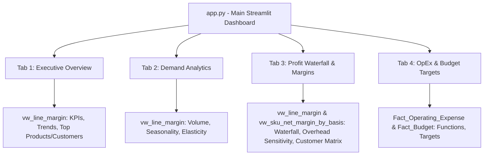

# Phase 2 Implementation: Enterprise Intelligence Platform & Live Analytics

**Project:** Demand Forecasting & Profit Prediction Engine  
**Interface:** Streamlit Web Application (`app.py`)  
**Deployment:** [https://manufacturer-demand-profit.streamlit.app/](https://manufacturer-demand-profit.streamlit.app/)  
**Status:** Completed & Live

---

## 1. Executive Summary

Phase 2 transformed the underlying DuckDB analytical model and ANSI SQL Semantic Layer into an interactive, enterprise-grade business intelligence dashboard. 

The application is built using **Streamlit**, **Plotly**, and **DuckDB**, featuring a cohesive dark-mode UI with dynamic sidebar filters and mathematical component reconciliation.

---

## 2. Dashboard Architecture & Analytical Tabs

### Tab Breakdown:

### Tab 1: 📊 Executive Overview (`src/components/overview.py`)
* **KPI Metrics:** Gross Revenue ($42.7M), Net Revenue ($32.1M), Units Sold (15.3M), Gross Profit ($16.9M, 52.5% Margin), and Pocket Contribution Margin ($11.3M, 35.3% Pocket Margin).
* **Monthly Revenue & Profit Trends:** Overlay of Net Sales, Gross Profit, and Contribution Margin by period.
* **Regional Revenue Share:** Donut chart breakdown across North, South, East, and West sales territories.
* **Top 5 Products & Customers:** High-performing SKUs and key accounts ranked by revenue and realized margin.

### Tab 2: 📦 Demand Analytics (`src/components/demand.py`)
* **Time-Series Demand Curves:** Multi-line volume trends over time by product category with customizable time aggregation (Monthly, Weekly, Daily).
* **Monthly Seasonality Matrix:** Visualizes demand distributions across calendar months to identify seasonal spikes.
* **Segment Volume Breakdown:** Compares channel volume across Enterprise, Mid-Market, and SMB accounts.
* **Price Elasticity & Discount Sensitivity:** Scatter plots with OLS trendlines correlating realized unit price and discount percentages with order volumes.

### Tab 3: 💰 Profit Waterfall & Margins (`src/components/profit.py`)
* **Financial Margin Waterfall:** Reconciles Gross Sales $\rightarrow$ Discounts $\rightarrow$ Returns $\rightarrow$ Net Sales $\rightarrow$ Material $\rightarrow$ Labor $\rightarrow$ Gross Profit $\rightarrow$ Freight (Cube-Allocated) $\rightarrow$ Rebates $\rightarrow$ Contribution Margin.
* **⚖️ Human-in-the-Loop Overhead Allocation Sensitivity:** Side-by-side comparison of **Units Produced Basis** vs. **Machine Hours Basis** (demonstrating how category margins shift, such as Cutlery switching between profitable and loss-making).
* **Customer Profitability Matrix:** Scatter plot exposing margin leakage on accounts affected by the rebate trap.
* **SKU & Category Profitability Summary:** Granular tabular breakdown of Net Revenue, Direct COGS, Gross Profit %, and Contribution Margin %.

### Tab 4: 🏢 OpEx & Budget Targets (`src/components/budget_opex.py`)
* **Operating Expense Distribution:** Horizontal bar and donut charts grouping corporate OpEx by function (SG&A, Operations, Sales, Marketing) and cost centers.
* **Budget vs. Forecast Benchmarks:** Grouped bar chart comparing Budgeted Revenue, Management Forecast, and Target Budget Profit across Profit Centers without scale distortion.

---

## 3. Key Enhancements & Reconciliations

1. **Exact Mathematical Tie-Out:**  
   Executive Overview Net Sales ($32,109,208) matches Waterfall Net Sales to the exact penny ($0.00 variance).
2. **Ambiguity-Free Multi-Dimension Filtering:**  
   Centralized query builder (`src/db.py`) prefixes table aliases (`m.`), preventing DuckDB binder collisions when filtering by Category, Segment, or Region.
3. **Embedded DuckDB Performance:**  
   Queries execute sub-second in-process without external database latency.
