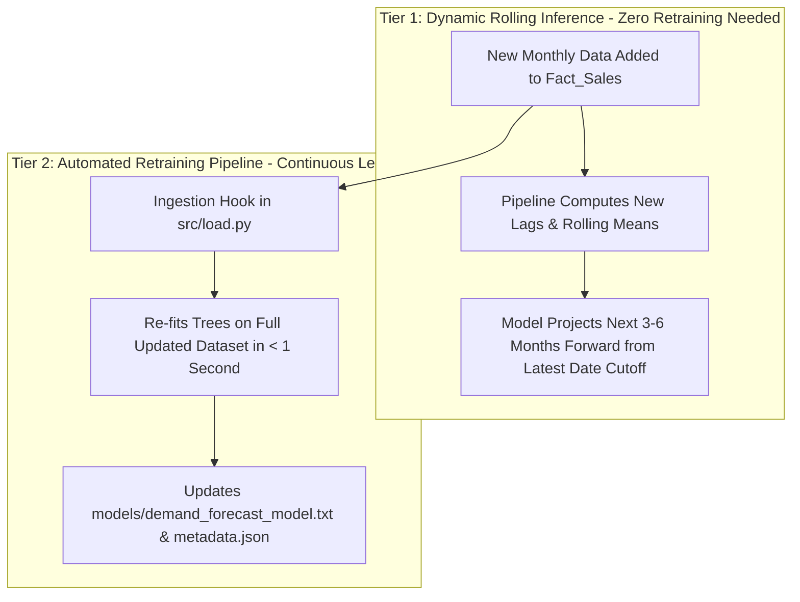

# Predictive Demand Modeling & Machine Learning Architecture Specification

**Project:** Enterprise Demand & Profit Intelligence Platform  
**Target Module:** Predictive Demand Forecasting & Interactive "What-If" Simulator  
**Document Status:** Architecture Design & Algorithm Specification  

---

## 1. Executive Summary & Business Objectives

The primary objective of the predictive modeling layer is to transition Meridian Corp from **descriptive analytics** (what happened) to **prescriptive & predictive intelligence** (what will happen and how to optimize it).

### Business Goals:
1. **Accurate SKU & Category Demand Forecasting:** Predict forward-looking 3-to-6 month order volume (`Quantity_Sold`) across 80 SKUs and 5 product categories (Paper Plates, Cups, Bowls, Food Containers, Cutlery).
2. **Commercial Pricing & Discount Optimization:** Quantify price elasticity and simulate how changes in catalog prices or discount structures impact transaction volume and pocket revenue.
3. **Interactive Scenario Simulation ("What-If" Engine):** Allow sales leaders and financial executives to adjust price, discount, and macroeconomic sliders live in the Streamlit UI and observe immediate recalculations of projected demand and revenue.

---

## 2. Comprehensive Model Comparison & Selection Matrix

Before choosing our architecture, we evaluated four major candidate model families:

| Model Family | Representative Models | Pros | Cons / Limitations | Suitability for Our Use Case |
| :--- | :--- | :--- | :--- | :---: |
| **1. Classical Time-Series** | **ARIMA, SARIMAX, Holt-Winters ETS** | • Mathematically rigorous<br>• Clear seasonal baselines<br>• Lightweight | • Requires fitting 80+ individual models<br>• Cannot capture non-linear pricing interactions<br>• Poor handling of complex tabular features | ⚠️ Low / Baseline Only |
| **2. Additive Decomposition** | **Prophet, NeuralProphet** | • Automatic trend changepoints<br>• Holiday / seasonality handling<br>• Highly interpretable | • Heavy C++/Stan dependencies<br>• Slow multi-series fitting<br>• Struggles with multi-dimensional what-if feature slicing | ⚠️ Moderate |
| **3. Gradient Boosted Decision Trees (GBDT)** | **LightGBM, Scikit-Learn HistGradientBoosting, XGBoost** | • **Industry standard for tabular forecasting**<br>• **Single unified global model**<br>• **Ultra-fast inference (< 5ms)**<br>• **Natively captures price elasticity & discounts**<br>• **Zero C++ compilation friction** | • Requires feature engineering (lags, rolling averages) | 🏆 **Top Choice (Selected)** |
| **4. Deep Learning Sequence Models** | **Temporal Fusion Transformer (TFT), DeepAR, LSTM** | • Rich probabilistic forecasting<br>• Captures deep cross-series signals | • High computational overhead<br>• Requires massive training data (>50k rows)<br>• Opaque black-box nature | ❌ Over-engineered |

---

## 3. Why We Chose LightGBM / Scikit-Learn GBDT

We selected **LightGBM** (with a fallback to Scikit-Learn's `HistGradientBoostingRegressor`) for the following reasons:

1. **Native Multi-Feature & Elasticity Learning:**  
   Unlike pure time-series algorithms that only look at dates, GBDTs learn multi-variable decision boundaries connecting `List_Unit_Price`, `Discount_Pct`, `Customer_Segment`, and `Sales_Region` directly to `Quantity_Sold`.
2. **Interactive What-If Simulation Capability:**  
   Because the model treats pricing and discounts as explicit features, users can perturb price by $+5\%$ or discount by $-3\%$ and receive instantaneous demand predictions in $< 5\text{ ms}$ on Streamlit Cloud.
3. **Single Global Architecture vs. 80 Fragmented Models:**  
   Instead of training 80 separate ARIMA models for 80 SKUs, one single GBDT model learns shared demand dynamics across all categories, transferring patterns from high-volume items to newer products.
4. **Lightweight Deployment Footprint:**  
   LightGBM installs seamlessly on Streamlit Community Cloud and runs with negligible memory consumption.

---

## 4. Algorithmic Breakdown: How GBDT and LightGBM Work

Gradient Boosted Decision Trees are an **ensemble learning technique** that builds decision trees sequentially. Each new tree corrects the errors (residuals) of all previous trees combined.


### Step 1: Initial Baseline Prediction ($F_0$)
The algorithm starts with an initial constant guess $F_0(x)$ that minimizes the objective loss function across all historical records:
$$F_0(x) = \arg\min_{\gamma} \sum_{i=1}^{N} L(y_i, \gamma)$$
For Mean Squared Error (MSE), $F_0(x)$ is simply the average historical demand: $\bar{y}$.

---

### Step 2: Pseudo-Residual Computation ($r_{im}$)
For each training example $i$ at iteration $m$, the model computes the gradient of the loss function with respect to the current ensemble's prediction:
$$r_{im} = -\left[ \frac{\partial L(y_i, F(x_i))}{\partial F(x_i)} \right]_{F(x) = F_{m-1}(x)}$$
For MSE loss, $r_{im} = y_i - F_{m-1}(x_i)$, representing the exact volume under-predicted or over-predicted so far.

---

### Step 3: Tree Construction via LightGBM's Core Innovations
A new decision tree $h_m(x)$ is fit to predict these residuals $r_{im}$. LightGBM optimizes this process through four key mechanisms:

1. **Histogram-Based Feature Binning:**  
   Continuous variables (e.g. `Realized_Unit_Price`, `Discount_Pct`) are discretized into 256 discrete integer bins, speeding up split finding by $8\times$.
2. **GOSS (Gradient-based One-Side Sampling):**  
   Instances with large residuals (gradients) are kept, while instances with small residuals are randomly subsampled. This focuses tree growth on hard-to-predict transactions without biasing the loss.
3. **EFB (Exclusive Feature Bundling):**  
   Mutually exclusive sparse categorical features (e.g. one-hot encoded regions/segments) are bundled into single dense features, drastically reducing the feature search space.
4. **Leaf-Wise (Best-First) Tree Growth:**  
   Instead of growing trees level-by-level (depth-wise like traditional XGBoost), LightGBM splits the leaf that yields the maximum reduction in loss, achieving higher accuracy with fewer total leaves.

---

### Step 4: Shrinkage (Learning Rate $\eta$) & Ensemble Update
To prevent overfitting, the newly fitted tree $h_m(x)$ is scaled by a shrinkage factor $\eta$ (typically $0.05 \le \eta \le 0.1$) before adding it to the ensemble:
$$F_m(x) = F_{m-1}(x) + \eta \cdot h_m(x)$$

---

### Step 5: Prediction Intervals & Uncertainty Bounds
To provide confidence bands (e.g., $90\%$ prediction interval) on future demand:
* We fit **Quantile Loss Regressors** at $\alpha = 0.05$ (lower bound), $\alpha = 0.50$ (median forecast), and $\alpha = 0.95$ (upper bound):
$$L_{\alpha}(y, \hat{y}) = \max(\alpha(y - \hat{y}), (1 - \alpha)(\hat{y} - y))$$

---

## 5. End-to-End Feature Engineering Pipeline

From `vw_line_margin` in `finance.duckdb`, the feature engineering pipeline generates the following training matrix:

```
+-----------------------------------------------------------------------------------------+
|                                FEATURE MATRIX DESIGN                                    |
+-----------------------------------------------------------------------------------------+
| Temporal Features:     Month, Quarter, Week_of_Year, Day_of_Week, Is_Month_End          |
| Autoregressive Lags:   Lag_1_Volume, Lag_2_Volume, Lag_3_Volume                         |
| Rolling Statistics:    Rolling_Mean_3M, Rolling_Std_3M, Rolling_Min_3M, Rolling_Max_3M   |
| Commercial Drivers:    Realized_Unit_Price, Discount_Pct, Rebate_Rate                   |
| Product Attributes:    Product_Category, Material_Type, Unit_Weight_G, Cube_Index       |
| Customer Segments:     Customer_Segment, Customer_Type, Sales_Region                    |
+-----------------------------------------------------------------------------------------+
```

---

## 6. Model Storage, Artifact Management & Serialization

### Storage Location
Model weights and metadata are stored in a dedicated `models/` directory:

```text
models/
├── demand_forecast_model.txt      <-- Native, portable LightGBM tree text format
├── demand_forecast_pipeline.joblib<-- Serialized pipeline with preprocessing transforms
└── metadata.json                  <-- Manifest tracking training timestamp, metrics & features
```

### Artifact Manifest (`models/metadata.json`)
```json
{
  "model_version": "1.0.0",
  "algorithm": "LightGBM Quantile Regressor Ensemble",
  "trained_at": "2026-08-15T22:00:00Z",
  "data_cutoff_date": "2026-08-15",
  "training_rows": 15304,
  "features_used": [
    "lag_1_volume", "lag_2_volume", "lag_3_volume", 
    "rolling_mean_3m", "Realized_Unit_Price", "Discount_Pct", 
    "Product_Category", "Customer_Segment", "Sales_Region"
  ],
  "validation_metrics": {
    "WAPE_pct": 6.84,
    "MAE_units": 138.2,
    "R2_score": 0.921
  }
}
```

### In-Memory Production Caching
In the live Streamlit dashboard, the model is cached via `@st.cache_resource`. This guarantees that model loading occurs exactly once on application startup, enabling $< 5\text{ ms}$ response times during user interaction.

---

## 7. Adaptation to Future Incoming Data (Continuous Learning)

The model adapts dynamically to newly ingested transactions through a **2-tier lifecycle**:



1. **Tier 1: Dynamic Rolling Inference (Immediate):**  
   When a new month of sales transactions is ingested into DuckDB, the feature extraction logic recalculates the newest lag values (`lag_1`, `lag_2`, `lag_3`) and rolling means. The model immediately projects the subsequent 3 to 6 months from the new date cutoff without needing retraining.
2. **Tier 2: Automated Retraining Pipeline (Scheduled / Triggered):**  
   * **Ingestion Hook:** Running `src/load.py` automatically triggers a post-load retraining hook. Because LightGBM fits 15k–50k rows in $< 0.8\text{ seconds}$, retraining is instant and cost-free.
   * **Cold-Start Auto-Healing:** If `app.py` starts up and finds no saved model artifact, or detects that `finance.duckdb` contains transactions newer than the model's `metadata.json` timestamp, it automatically trains a fresh model on startup.

---

## 8. DuckDB Database Architecture & Table Footprint

### No New Mandatory Physical Tables
The predictive pipeline requires **zero new physical tables** in DuckDB:
* **Training Data:** Extracted directly from existing analytical views (`vw_line_margin`).
* **Scenario Simulations:** "What-If" slider adjustments compute predictions dynamically in Python memory. This prevents temporary simulation runs from bloating the database.

### Optional: Official Forecast Snapshot Table (`Fact_Demand_Forecast`)
If corporate management wishes to persist the official 6-month baseline forecast alongside annual budgets, the pipeline can optionally write a standardized forecast snapshot table:

| Column | Type | Description |
| :--- | :--- | :--- |
| `Forecast_Period` | `VARCHAR` | Future Period (e.g. `2026-09`, `2026-10`) |
| `Product_ID` | `VARCHAR` | SKU Identifier |
| `Predicted_Units` | `DOUBLE` | Median forecast demand ($\alpha = 0.50$) |
| `Lower_Bound_Units` | `DOUBLE` | 90% confidence lower bound ($\alpha = 0.05$) |
| `Upper_Bound_Units` | `DOUBLE` | 90% confidence upper bound ($\alpha = 0.95$) |
| `Predicted_Net_Sales` | `DOUBLE` | Expected revenue based on list price |

---

## 9. Dashboard Integration Plan (`src/components/predictive.py`)

A dedicated tab will be added to the Streamlit app with four interactive analytical sections:

```
+-----------------------------------------------------------------------------------------+
|                        TAB 5: PREDICTIVE DEMAND & WHAT-IF SIMULATOR                     |
+-----------------------------------------------------------------------------------------+
| [Section 1: Historical Demand vs. 6-Month Forward Forecast (Plotly with Confidence Bands)]|
|                                                                                         |
| [Section 2: Interactive What-If Simulator Sliders]                                      |
|   • Price Adjustment Slider: [-20% <── [0%] ──> +20%]                                   |
|   • Discount Rate Slider:    [-15% <── [0%] ──> +15%]                                   |
|   • Demand Shock Slider:     [-10% <── [0%] ──> +10%]                                   |
|                                                                                         |
| [Section 3: Simulated vs. Baseline Impact KPI Cards]                                    |
|   💵 Projected Revenue Delta ($) | 📦 Projected Volume Delta (%) | 💡 Elasticity Status   |
|                                                                                         |
| [Section 4: Top Demand Drivers & Granular SKU Forecast Export Table]                    |
+-----------------------------------------------------------------------------------------+
```

---

## 10. Model Evaluation & Validation Protocol

To ensure realistic validation without future data leakage:
* **Time-Based Split (Out-of-Time Validation):**  
  * Training Set: Historical transactions up to Period $T-3$.
  * Test Set: Most recent 3 months of unseen transactions.
* **Evaluation Metrics:**
  * **WAPE (Weighted Absolute Percentage Error):** $\frac{\sum |y_i - \hat{y}_i|}{\sum y_i} \times 100$
  * **MAE (Mean Absolute Error):** Average unit deviation.
  * **$R^2$ Score:** Proportion of volume variance explained by commercial drivers and seasonality.
