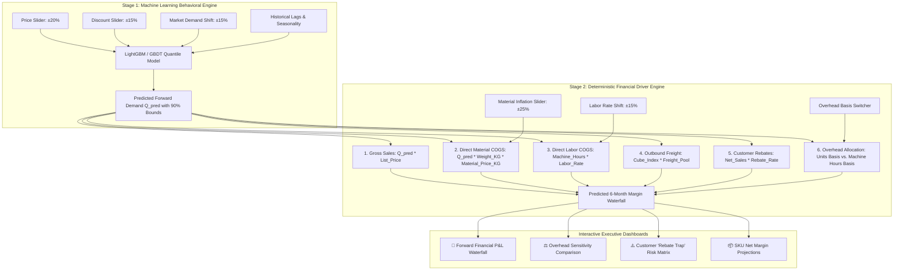

# Predictive Profitability & 2-Stage Financial Simulation Specification

**Project:** Enterprise Demand & Profit Intelligence Platform  
**Target Module:** 2-Stage Cascaded Demand & Profitability Prediction Engine  
**Document Status:** Architecture & Mathematical Specification  

---

## 1. Executive Summary & The Core Architectural Dilemma

A common design flaw in AI finance systems is treating **Net Profitability ($)** as a single black-box machine learning regression target ($\hat{y} = f(X)$).

### Why Direct Black-Box Profit Prediction Fails:
1. **Mathematical Incoherence (P&L Breakdown):**  
   If a model independently predicts $\hat{Q} = 10,000\text{ units}$, $\hat{R} = \$50,000\text{ revenue}$, and $\hat{P} = \$8,000\text{ profit}$, the underlying accounting identity ($\text{Revenue} - \text{COGS} - \text{Freight} - \text{Rebates} \equiv \text{Profit}$) is violated. Financial auditors and CFOs cannot trust numbers that do not tie out to the penny.
2. **Confounding Market Behavior with Cost Accounting:**  
   Customer demand volume is driven by **market behavior & price elasticity** (stochastic / behavioral). Cost and overhead allocation are driven by **physical engineering & managerial accounting rules** (deterministic). Conflating them in one model destroys causal explainability.

### The Solution: 2-Stage Cascaded Financial Architecture
To solve this, our platform uses a **2-Stage Cascaded Engine**:
* **Stage 1 (Machine Learning Demand Model):** Predicts market demand volume ($Q_{\text{pred}}$) with $90\%$ confidence bounds ($\alpha=0.05, 0.50, 0.95$) based on pricing, discounts, lags, and seasonality.
* **Stage 2 (Financial Driver & Cost Engine):** Ingests $Q_{\text{pred}}$ and deterministically propagates costs through the exact physical manufacturing formulas and ANSI SQL Semantic Layer, supporting interactive cost inflation and overhead allocation simulations.

---

## 2. 2-Stage Cascaded Architecture Diagram

---

## 3. Mathematical Formulation of Cost Drivers

For every simulated forward period $t$, category $c$, and SKU $s$:

### 1. Revenue Dynamics:
$$\text{Gross Revenue}_{s,t} = Q_{s,t}^{\text{pred}} \times \text{List Unit Price}_s \times (1 + \Delta_{\text{price}})$$
$$\text{Net Revenue}_{s,t} = \text{Gross Revenue}_{s,t} \times (1 - \text{Discount Rate}_{s,t} - \Delta_{\text{discount}})$$

### 2. Direct Manufacturing COGS:
$$\text{Direct Material Cost}_{s,t} = Q_{s,t}^{\text{pred}} \times \left(\frac{\text{Unit Weight G}_s}{1000}\right) \times \text{Market Price Per KG}_{m,t} \times (1 + \Delta_{\text{mat\_inflation}})$$
$$\text{Direct Labor Cost}_{s,t} = Q_{s,t}^{\text{pred}} \times \left(\frac{\text{Machine Hours}}{\text{Unit}}\right)_s \times \text{Plant Labor Rate} \times (1 + \Delta_{\text{labor\_shift}})$$
$$\text{Gross Profit}_{s,t} = \text{Net Revenue}_{s,t} - \text{Direct Material Cost}_{s,t} - \text{Direct Labor Cost}_{s,t}$$

### 3. Below-the-Line Cost-to-Serve (Rebates & Freight):
$$\text{Cube Freight}_{s,t} = Q_{s,t}^{\text{pred}} \times \text{Cube Index}_s \times \text{Freight Cost Per Cube Unit}$$
$$\text{Rebate Amount}_{s,t} = \text{Net Revenue}_{s,t} \times \text{Rebate Rate}_c \quad (\text{if Qualifying Threshold Met})$$
$$\text{Contribution Margin}_{s,t} = \text{Gross Profit}_{s,t} - \text{Cube Freight}_{s,t} - \text{Rebate Amount}_{s,t}$$

### 4. Overhead Allocation & Net Margin:
* **Option A (Units Produced Basis):**
  $$\text{Allocated Overhead}_{s,t}^{\text{Units}} = \text{Plant Overhead Pool}_t \times \left(\frac{Q_{s,t}^{\text{pred}}}{\sum_j Q_{j,t}^{\text{pred}}}\right)$$
* **Option B (Machine Hours Basis):**
  $$\text{Allocated Overhead}_{s,t}^{\text{Hours}} = \text{Plant Overhead Pool}_t \times \left(\frac{\text{Total Machine Hours}_{s,t}}{\sum_j \text{Total Machine Hours}_{j,t}}\right)$$
$$\text{Net Margin}_{s,t} = \text{Contribution Margin}_{s,t} - \text{Allocated Overhead}_{s,t}$$

---

## 4. Interactive Simulation Levers on the Dashboard

The integrated **Predictive Demand & Profitability Tab** provides dual-cockpit controls:

| Lever Category | Control Widget | Range | Business Question Answered |
| :--- | :--- | :---: | :--- |
| **Commercial** | 💵 Unit Price Adjustment | $-20\%$ to $+20\%$ | *"What is the optimal price point that maximizes gross profit dollars without sacrificing too much volume?"* |
| **Commercial** | 🏷️ Discount Policy Shift | $-15\%$ to $+15\%$ | *"If we reduce promotional discounting by 5%, how much pocket revenue is retained?"* |
| **Cost Inflation** | 🌾 Raw Material Cost Shift | $-25\%$ to $+25\%$ | *"If global Bagasse/PLA commodity prices surge by 15%, how much does our Gross Margin compress?"* |
| **Operations** | ⚙️ Plant Labor Rate Shift | $-15\%$ to $+15\%$ | *"What is the financial impact of upcoming plant labor union rate negotiations?"* |
| **Policy** | ⚖️ Overhead Allocation Basis | `Units` vs. `Machine Hours` | *"Which product categories become unprofitable when allocating facility costs based on actual machine run time?"* |

---

## 5. Risk Detection: The Customer "Rebate Trap" Matrix

Stage 2 automatically evaluates customer account health by identifying accounts in the **Rebate Trap**:
* **High Gross Revenue + High Off-Invoice Rebates + High Delivery Freight = Negative Pocket Margin.**
* The dashboard flags these accounts with an automated risk badge and quantifies the exact pricing or rebate renegotiation needed to restore profitability.

---

## 6. Verification & Mathematical Auditability

Because Stage 2 relies on explicit accounting relationships, the system enforces a **Zero-Variance Audit Tie-Out**:
$$\sum \text{Gross} - \sum \text{Discounts} - \sum \text{Material} - \sum \text{Labor} - \sum \text{Freight} - \sum \text{Rebates} - \sum \text{Overhead} \equiv \sum \text{Net Margin}$$
This guarantees $100\%$ credibility during executive presentations and financial audits.
