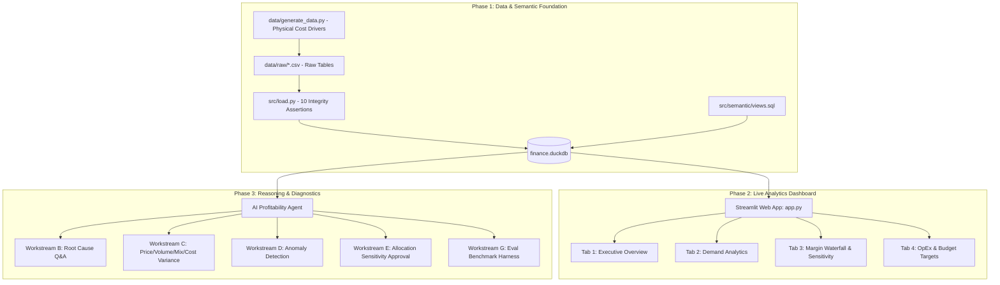

# Project Implementation Roadmap
## Demand Forecasting, Profit Prediction & Conversational BI Engine

**Target Architecture:** Driver-Based Synthetic Data Generator + DuckDB Analytical Engine + ANSI SQL Semantic Layer + Streamlit Intelligence Platform + AI Reasoning Agent  
**Live URL:** [https://manufacturer-demand-profit.streamlit.app/](https://manufacturer-demand-profit.streamlit.app/)

---

## 🗺️ Architectural Workflow Overview

---

## 📌 Phase-by-Phase Step Breakdown

---

### Phase 1: Data Engine, Schema Decoupling & Semantic SQL Layer (Completed ✅)

#### Objectives & Deliverables:
1. **Driver-Based Cost Modeling (`data/generate_data.py`):**
   * Built physical cost drivers (kg $\times$ material unit price, machine hours $\times$ plant labor rates).
   * Fixed future dates and enforced component tie-outs ($\text{Gross} - \text{Discounts} - \text{Returns} = \text{Net}$).
2. **Schema Decoupling:**
   * Moved factory overhead into unallocated monthly plant pools (`Fact_Overhead_Pool`).
   * Moved outbound delivery costs into order freight (`Fact_Freight`), cube-allocated per shipment.
3. **Automated Assertion Suite (`src/load.py`):**
   * Ingests CSVs into `finance.duckdb` while enforcing 10 database-level integrity assertions.
4. **ANSI SQL Semantic Views (`src/semantic/views.sql`):**
   * Single-source-of-truth views (`vw_sales_clean`, `vw_line_margin`, `vw_margin_waterfall`, `vw_overhead_allocated`, `vw_sku_net_margin_by_basis`, `vw_customer_profitability`, `vw_sku_profitability`).

---

### Phase 2: Streamlit Intelligence Platform & Live Deployment (Completed ✅)

#### Objectives & Deliverables:
1. **Interactive Analytics UI (`app.py` & `src/components/`):**
   * **Executive Overview:** Reconciled KPIs, monthly revenue/profit trends, regional donut chart, top products and customers.
   * **Demand Analytics:** Time series volume by category, monthly seasonality matrix, customer channel breakdown, price elasticity and discount sensitivity scatter plots.
   * **Profit Waterfall & Sensitivity:** Full financial waterfall ($\text{Gross Sales} \rightarrow \text{Contribution Margin}$), customer profitability matrix exposing the "rebate trap", and interactive **Overhead Allocation Sensitivity Switcher** (Units Produced vs. Machine Hours).
   * **OpEx & Budget Targets:** Operating expense function breakdown (SG&A, Operations, Sales, Marketing) and budget vs. forecast comparisons without axis distortion.
2. **Cloud Deployment:**
   * Deployed live on Streamlit Community Cloud: [https://manufacturer-demand-profit.streamlit.app/](https://manufacturer-demand-profit.streamlit.app/).
   * Pre-compiled DuckDB embedded database with zero-latency in-memory query execution.

---

### Phase 3: AI Agent Reasoning & Diagnostics Layer (In Progress 🔄)

#### Objectives & Workstreams:
1. **Workstream B (Profitability Agent):**
   * Natural language question answering with clear citation and evidence trails back to DuckDB views.
2. **Workstream C (Variance Explanation):**
   * Decompose month-over-month and budget-vs-actual margin variances into Price, Volume, Mix, and Cost drivers.
3. **Workstream D (Anomaly Detection):**
   * Detect duplicate invoices, unflagged returns, price-cost divergence, and rebate leakage.
4. **Workstream E (Allocation Sensitivity & Human Approval):**
   * Dynamic simulation of overhead allocation impacts and human-in-the-loop approval workflows before actioning financial decisions.
5. **Workstream G (Evaluation & Grading Harness):**
   * Automated grading (`eval/score.py`) scoring agent responses against planted ground-truth findings (`eval/answer_key.yaml`).
